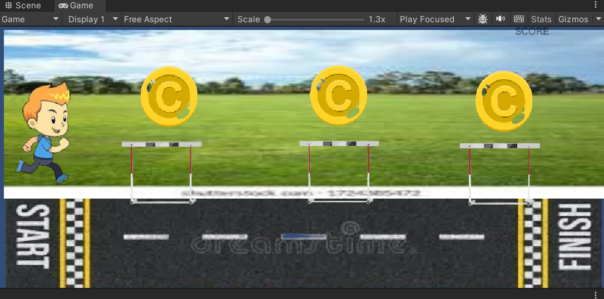

# Ex3---Hurdle-Game-2D

## AIM:

To develop a 2D game using C# program in unity .


## ALGORITHM:

## STEP 1: 

Create a 2D project in unity.

## STEP 2: 

Add player,hurdles,coins,track in the frame and add the valid collider2D component.

## STEP 3: 

Click Assets->Create-># Script.

## STEP 4: 

Create player.cs and coinmanger script and add c# code.

## STEP 5: 

Click canvas->Gamemanager->add Score and value.

## STEP 6: 

Drag the script to player and coin.

## STEP 7:

Run the scene and display the output.

## PROGRAM:

Developed by : Vinush.cv

Reg no : 212222230176

## Player.cs:
```c#
using System.Collections;
using System.Collections.Generic;
using UnityEngine;
using System.Threading;
using System;
public class Player : MonoBehaviour
{
    public float speed;
    public float jumpforce;
    private Rigidbody2D rb;
    public Score cc;
    void Start()
    {
        rb = GetComponent<Rigidbody2D>();
    }

    // Update is called once per frame
    void Update()
    {
        float moveinp = Input.GetAxisRaw("Horizontal");
        transform.position += new Vector3(moveinp, 0, 0)*speed*Time.deltaTime;
        if (Input.GetKeyDown(KeyCode.Space)&&Mathf.Abs(rb.velocity.y) < 0.001f)
        {
            rb.AddForce(new Vector2(0, jumpforce), ForceMode2D.Impulse);
        }
    }

    private void OnTriggerEnter2D(Collider2D collision)
    {
        if(collision.CompareTag("destroy"))
        {
            cc.coincount++;
            Destroy(collision.gameObject);
        }
    }
}
```
## Coin Manager.cs:
```c#
using System.Collections;
using System.Collections.Generic;
using UnityEngine;
using UnityEngine.UI;

public class Score : MonoBehaviour
{
    // Start is called before the first frame update
    public int coincount;
    public Text value;
    void Start()
    {
        
    }

    // Update is called once per frame
    void Update()
    {
        value.text=coincount.ToString();
    }
}
```
## OUTPUT:



## RESULT:

Thus a 2D game using C# program in unity is developed successfully.

